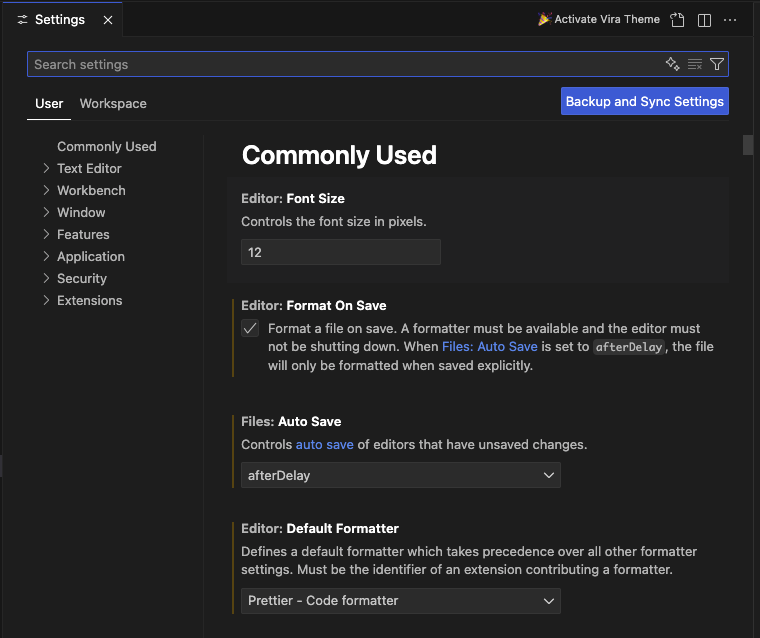

# Installation and Setup Guide for Visual Studio Code

Visual Studio Code (VS Code) is a lightweight, powerful code editor ideal for frontend development and documentation projects. This guide will help you install VS Code and configure it for optimal productivity.

---

## Step 1: Install Visual Studio Code

### macOS

1. Go to the [VS Code download page](https://code.visualstudio.com/).
2. Download the macOS version (`Universal` for Apple Silicon and Intel).
3. Open the `.dmg` file and drag the VS Code application to your **Applications** folder.
4. Launch VS Code from **Applications** or Spotlight.

### Windows

1. Go to the [VS Code download page](https://code.visualstudio.com/).
2. Download the Windows installer (`User Installer` or `System Installer` for admin privileges).
3. Run the installer and follow the on-screen instructions.
4. Open VS Code from the Start Menu or Desktop shortcut.

---

## Step 2: Install Extensions for Frontend Development

### Recommended Extensions

1. **JavaScript/TypeScript**

   - Extension: [ESLint](https://marketplace.visualstudio.com/items?itemName=dbaeumer.vscode-eslint)
   - Extension: [Prettier - Code Formatter](https://marketplace.visualstudio.com/items?itemName=esbenp.prettier-vscode)

2. **Documentation**

   - Extension: [markdownlint](https://marketplace.visualstudio.com/items?itemName=DavidAnson.vscode-markdownlint)

3. **Diagram Creation**

   - Extension: [Draw.io Integration](https://marketplace.visualstudio.com/items?itemName=hediet.vscode-drawio)
     - Use this extension to create and edit diagrams directly within VS Code.
   - Extension: [Markdown Preview Mermaid Support](https://marketplace.visualstudio.com/items?itemName=bierner.markdown-mermaid)
     - This extension enables rendering of **Mermaid** diagrams in Markdown preview.

4. **GitHub Copilot**
   - Extension: [GitHub Copilot](https://marketplace.visualstudio.com/items?itemName=GitHub.copilot)
     - AI-powered code completion and suggestions.
   - Extension: [GitHub Copilot Chat](https://marketplace.visualstudio.com/items?itemName=GitHub.copilot-chat)
     - AI-powered conversational assistant for coding.

---

## Step 3: Configure VS Code Settings

### Frontend Development Settings

1. Open VS Code.
2. Go to **File > Preferences > Settings** (or use `Ctrl + ,` on Windows or `Cmd + ,` on macOS).
3. Add or modify the following settings:
   

## Step 4: Customize Themes and Icons

### Recommended Themes

1. Install [Github Theme](https://marketplace.visualstudio.com/items?itemName=GitHub.github-vscode-theme).

### Recommended Icon Pack

- Install [VSCode Icons](https://marketplace.visualstudio.com/items?itemName=robertohuertasm.vscode-icons).

---

## Step 5: Install Node.js and Git

### Node.js

1. Download and install Node.js from [nodejs.org](https://nodejs.org/).
2. Verify installation:

   ```bash
   node --version
   npm --version
   ```

### Git

1. Download and install Git from [git-scm.com](https://git-scm.com/).
2. Configure global settings:

   ```bash
   git config --global user.name "Your Name"
   git config --global user.email "your.email@example.com"
   ```

---

By following these steps, your VS Code setup will be optimized for frontend and documentation projects!
